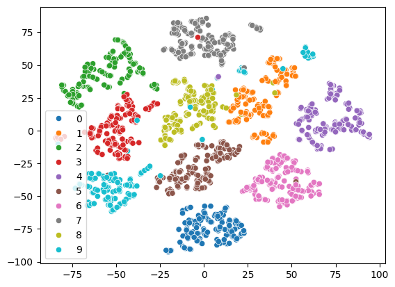
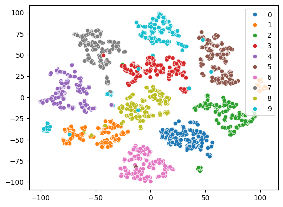

# t-SNE from Scratch

This is a simple implementation of the t-SNE (t-distributed Stochastic Neighbor Embedding) algorithm in Python.

It reduces high-dimensional data into 2D  for visualization while preserving local structure.

## Overview

### t-SNE works by:

- Computing pairwise similarities in high-dimensional space.

- Defining pairwise similarities in low-dimensional space.

- Iteratively minimizing the divergence between these distributions using gradient descent.

## Main Components

Below is an explanation of each function in this implementation:

 ### `dist_matrix(X)`

Computes the pairwise squared Euclidean distances between all samples in X.
It returns an n×n matrix D where D[i, j] is the squared distance between samples i and j.

$$D_{ij} = \|x_i - x_j\|^2 $$

### `probability_matrix(sigma, i)`

Calculates the conditional probability distribution matrix P for higher dimensions given a point i and variance (sigma).
For point i, computes p(j|i) using a Gaussian kernel:

$$p_{j|i} = \frac{\exp(-\beta_i D_{ij})}{\sum_{k \ne i} \exp(-\beta_i D_{ik})}$$

### `sigma(perplexity, dist_m)`

Finds the optimal variance (sigma) for each data point to match the desired perplexity. We
use binary search to find sigma such that the Shannon entropy of the conditional distribution matches.

$$Perp (P_i) = 2^{H(P_i)}$$

$$
H(P_i)=-\sum_j P_{j|i}log_2{ p_{j|i}}
$$

$$σ_i=\frac{σ_{min}+σ_{max}}{2}$$

### `symmetrize_matrix(m)`

It makes a matrix symmetrical by averaging it with its transpose. In t-SNE, it ensures that the  strength between any two points is mutual and consistent.

$$p_{ij} = \frac{p_{j|i} + p_{i|j}}{2n}$$

### `init_embed(n_components)`

Initializing low dimensional embeddings on dimension: 'n_components' with mean 0 and some noise to avoid same gradients
 
### `low_dim_prob_matrix()`

Computes matrix Q with pairwise probabilities in the low-dimensional embedding.

$$q_{ij} = \frac{(1 + D_{ij})^{-1}}{\sum_{k \ne l} (1 + D_{kl})^{-1}}$$

### `gradient_descent(y,p,q)`

Computes the gradient of KL divergence between P and Q with respect to low-dimensional positions y.
It is the core of optimization—updates y to minimize divergence.

$$
\frac{\partial \text{KL}}{\partial y_i} = 4 \sum_{j \ne i} (p_{ij} - q_{ij}) \cdot \frac{y_i - y_j}{1 + \|y_i - y_j\|^2}
$$

### `update_with_momentum(learning_rate,momentum,y,P,Q,gains)`

Updates positions y by applying gradient descent with momentum and gains.
It adjusts gains based on sign changes in gradient direction.

$$
\begin{aligned}
v_i^{(t+1)} &= \mu \cdot v_i^{(t)} - \eta \cdot gain\cdot \frac{\partial \text{KL}}{\partial y_i^{(t)}} \\\\
y_i^{(t+1)} &= y_i^{(t)} + v_i^{(t+1)}
\end{aligned}
$$

### `tsne(X,perplexity,learning_rate,early_exaggeration,max_iter)`

Main function that runs the entire t-SNE algorithm.

## Steps:

1. Computes high-dimensional distance matrix.
2. Finds optimal sigma for each point.
3. Computes high-dimensional joint probability matrix P.
4. Initializes low-dimensional positions y randomly.
5. Computes low-dimensional joint probability matrix Q.
6. Iteratively updates y using gradient descent with momentum and gains.
7. Applies early exaggeration to improve cluster separation in early iterations.

## sklearn t-SNE model

## t-SNE from scratch

 
